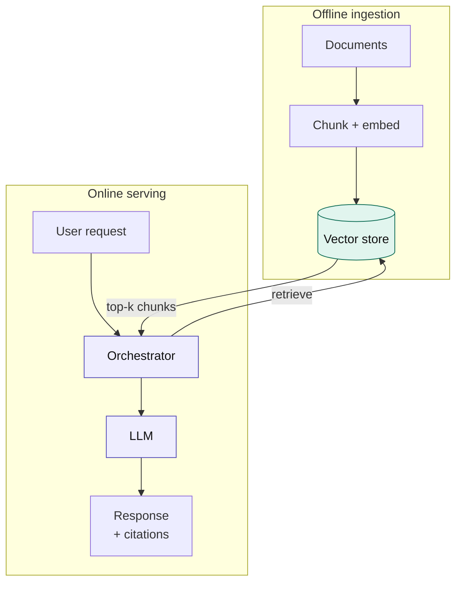
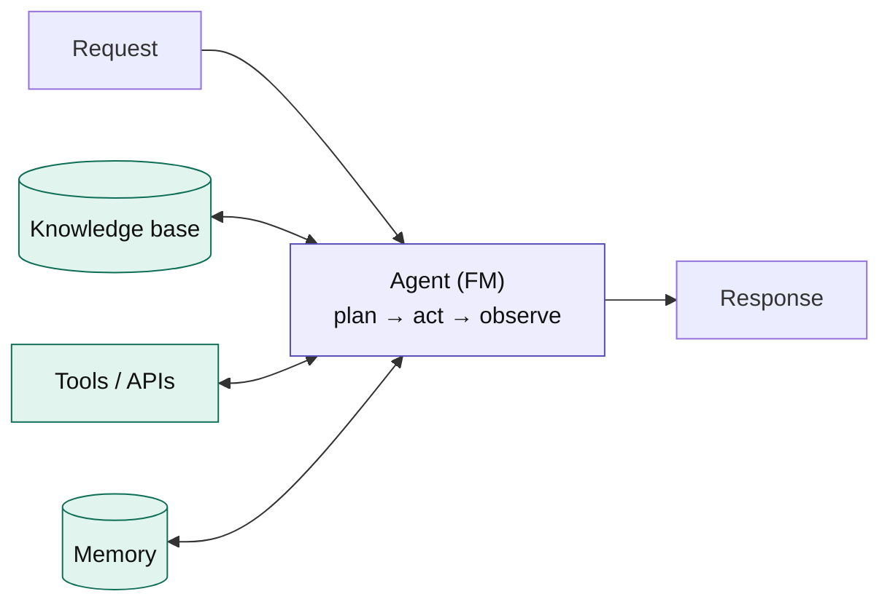

# Enterprise AI Architecture Primer

*Learning enterprise LLM and agentic AI architecture, one pattern at a time.*

Inspired by the structure of [`system-design-primer`](https://github.com/donnemartin/system-design-primer), this is a community-driven, walkable primer for the question every enterprise team is currently re-litigating from scratch: **when do you reach for a chatbot, RAG, an agent, or a full multi-agent system — and what does "production-ready" actually require around it?**

There is no single neutral standard for this yet. Vendors publish their own reference architectures; this primer distills the patterns that recur **across** Azure, AWS, and Anthropic guidance into one vendor-agnostic map, with diagrams you can actually study and reuse in a real design proposal.

> 🚧 **This is a living document.** Star it, fork it, open a PR. See [Contributing](#contributing).

---

## How to use this primer

- **New to enterprise AI architecture?** Read Sections I–III in order. They build on each other.
- **Prepping for an architect interview or design review?** Section II (the decision layer) is the part that actually gets debated in interviews — know it cold.
- **Scoping a real project?** Jump straight to [Section II](sections/02-decision-layer.md) to find your pattern, then to the matching diagram in [Section III](sections/03-core-patterns.md).
- **Want vendor specifics?** [Section VII](sections/07-cloud-mappings.md) maps every pattern to Azure / AWS / Anthropic services — kept in a single swappable table so it doesn't rot when service names change.

---

## Index

### I. [Foundations](sections/01-foundations.md)
What an LLM actually is in systems terms, tokens and context windows as a resource budget, capability tiers (small/fast vs frontier-reasoning), and the build-vs-buy question.

### II. [The Decision Layer](sections/02-decision-layer.md)
**Start here for any real project.** The gate ("do you even need GenAI?"), and the RAG vs. fine-tuning vs. workflow vs. agent decision — the single most-debated question in enterprise AI right now.

### III. [Core Architecture Patterns](sections/03-core-patterns.md)
The patterns themselves, each with a diagram: RAG, single tool-using agent, multi-agent supervisor, and MCP / tool-use as the connective tissue between them.

### IV. [Platform Capabilities](sections/04-platform-capabilities.md)
The reusable infrastructure that makes the patterns in Section III safe to run at scale: the GenAI gateway, prompt registry & versioning, vector store selection, and caching.

### V. [Production Operations](sections/05-production-operations.md)
The lane every diagram-only tutorial skips: evaluation, observability/tracing, guardrails, and cost/latency monitoring. This is what separates a demo from a system you can put your name on.

### VI. [Industry Walkthroughs](sections/06-industry-walkthroughs.md)
The same decision layer and patterns applied to four real domains: banking, healthcare, travel/airline, and customer service/case automation.

### VII. [Cloud-Specific Mappings](sections/07-cloud-mappings.md)
Azure / AWS / Anthropic service tables for every pattern above — separated from the core logic so it can be updated independently as services evolve.

---

## Example architecture diagrams

Two of the most-used patterns — rendered here so you can see the visual style before diving in.

**Enterprise RAG** — the default starting pattern for most enterprise GenAI work. Two flows share one vector store: an offline ingestion pipeline and an online serving path.

**Tool-using agent** — when the task requires adaptive planning: the model runs a plan → act → observe loop, calling tools until it has a final answer.

> **Color key:** purple = compute / reasoning components · teal = data / knowledge resources · gray = deterministic steps or plain I/O

See [Section III](sections/03-core-patterns.md) for all four patterns with full trade-off tables.

---

## Design principle behind this primer

Every pattern here is presented with three things, on purpose:

| | |
|---|---|
| **When to propose it** | The signal that this is the right pattern for a use case |
| **What to get right** | The one or two details that separate production from demo |
| **When *not* to use it** | The simpler pattern you should reach for first |

The most valuable skill in enterprise AI architecture is not knowing the most complex pattern — it's knowing when the *simple* pattern is correct, and being able to defend that choice. Most "we need a multi-agent system" proposals are really one well-tooled agent. This primer is built to teach that judgment, not just the diagrams.

---

## Contributing

This primer gets better with more eyes from people actually fighting these debates inside real organizations.

- **Found a pattern we're missing?** Open an issue.
- **Have a production war story that changes the guidance?** PRs to the relevant section, with a short rationale, are very welcome.
- **Disagree with a "when to propose" call?** Open a discussion — these are judgment calls, and the field is young enough that reasonable architects disagree.

See [`CONTRIBUTING.md`](CONTRIBUTING.md).

## License

[MIT](LICENSE) — use this freely in your own proposals, decks, and interviews.
