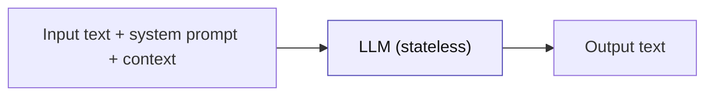
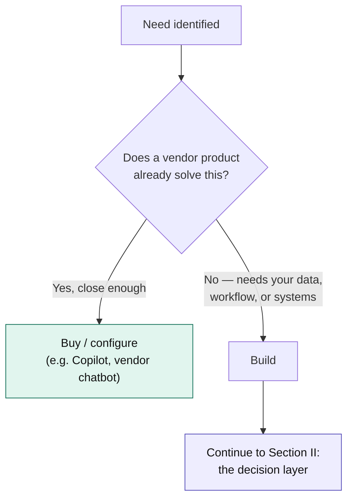

[← Back to index](../README.md) · **Section I of VII**

# I. Foundations

*What you need to know before any architecture decision makes sense.*

---

## 1.1 An LLM, in systems terms

For architecture purposes, ignore the model internals and treat an LLM as a **stateless function**:

```
text in → text out, with no memory of the last call
```

Everything else in enterprise AI architecture — RAG, agents, memory, orchestration — exists to compensate for that one fact. The model doesn't know your company's data (→ RAG), doesn't remember the last turn (→ session/memory layer), and can't take actions on its own (→ tools/agents).



Keep this model in your head through the whole primer: **every pattern in Section III is just a different way of constructing what goes into that box, and a different way of acting on what comes out.**

## 1.2 Tokens and context window: the resource budget

A **token** is roughly ¾ of a word. The **context window** is the maximum number of tokens (input + output combined) a model can handle in one call.

This matters architecturally for three reasons:

- **Cost** scales with tokens in and out, so anything that grows your prompt (more retrieved chunks, longer conversation history, verbose tool outputs) has a direct cost line.
- **Latency** scales with output tokens roughly linearly — a system that generates long responses will feel slow regardless of which model you pick.
- **Quality degrades** with very long, cluttered contexts even within the stated limit — "the model technically supports 200K tokens" is not the same claim as "the model reasons well over 200K tokens of mixed-relevance content."

**Architectural implication:** context window size is a budget you design against, not a feature you maximize. A RAG system that stuffs in 40 retrieved chunks "to be safe" is usually worse than one that retrieves 5 well-ranked chunks — both in cost and in answer quality.

## 1.3 Capability tiers

Don't think in named models (they change too fast to be the unit of architecture). Think in **tiers**, and let the cloud-mapping table ([Section VII](07-cloud-mappings.md)) translate a tier into a current model name.

| Tier | Profile | Good fit | Bad fit |
|---|---|---|---|
| **Fast / cheap** | Low latency, low cost, weaker multi-step reasoning | High-volume classification, routing, simple extraction, summarization | Complex multi-step reasoning, ambiguous judgment calls |
| **Mid / balanced** | Solid reasoning, moderate cost | Most RAG Q&A, drafting, structured generation | Tasks needing frontier reasoning or very long autonomous chains |
| **Frontier / reasoning** | Best multi-step reasoning, highest cost and latency | Complex agentic planning, hard analysis, high-stakes judgment | High-volume simple tasks — wasteful and slow |

A common, durable enterprise pattern: route by tier using a fast/cheap model as a **classifier or router**, escalating only the cases that need it to the frontier tier. This is one of the highest-leverage, least-discussed cost optimizations in production LLM systems — most teams send everything to the most expensive model out of convenience, then discover the bill.

## 1.4 Build vs. buy

Before any pattern choice, one more gate: **do you need a custom system at all?**



The mistake to watch for in either direction:

- **Building what should be bought** — re-implementing a generic chatbot or document Q&A that Microsoft 365 Copilot, a vendor's built-in assistant, or an off-the-shelf tool already does adequately. This burns engineering time on undifferentiated work.
- **Buying what should be built** — accepting a generic vendor tool for a workflow that's actually core to your competitive differentiation or deeply specific to your internal systems, and then fighting the tool's limitations forever.

A useful test: **if this worked perfectly, would it be a competitive advantage, or just table stakes?** Table stakes → lean toward buy. Advantage or deeply org-specific → build.

---

**Next:** [II. The Decision Layer →](02-decision-layer.md)
