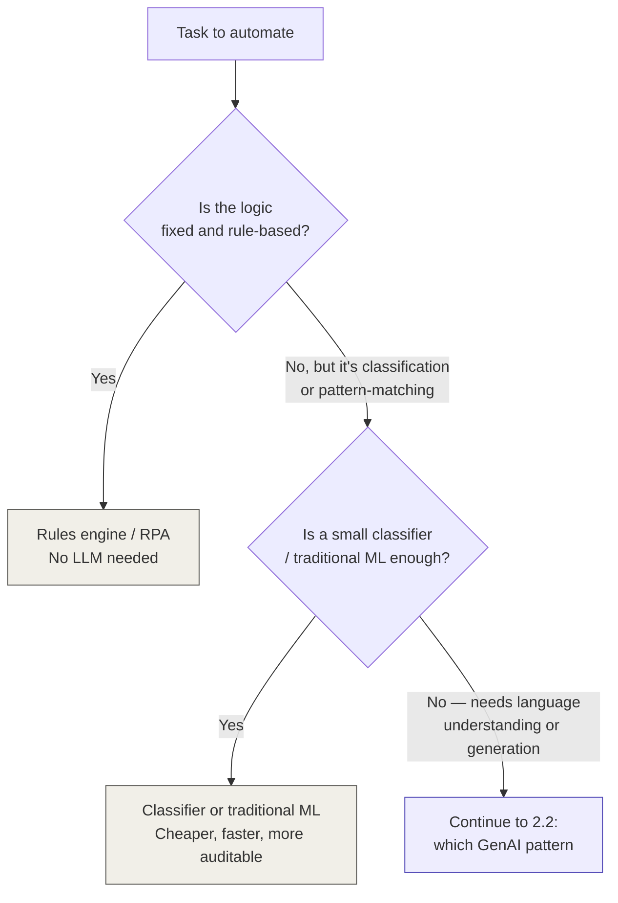
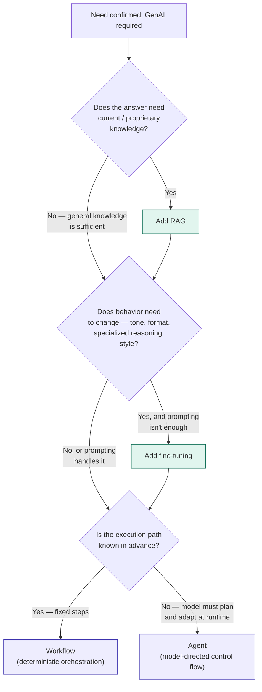

[← Back to index](../README.md) · **Section II of VII**

# II. The Decision Layer

*The single most-debated question in enterprise AI right now — and the part of this primer to know cold.*

There is no neutral, vendor-blessed standard for this decision. Every cloud vendor's reference architecture quietly steers toward its own services. What follows is the cross-vendor consensus, stripped of vendor framing.

---

## 2.1 The gate: do you need GenAI at all?

This is the step almost every internal debate skips, and skipping it is the single most common architecture mistake in enterprise AI right now.

**Why this matters more than people think:** a rules engine or classifier is cheaper to run, faster, fully deterministic, and trivially auditable for compliance. An LLM is none of those things by default. Every box that exits left in this diagram is a system that's easier to defend in a governance review, a security audit, and an incident postmortem.

**The tell that you've skipped this gate:** if you can write the entire decision logic as an `if/else` tree or a short list of regex patterns, you don't need an LLM — you need that tree.

> Many internal "should we use an LLM for this?" debates dissolve the moment someone draws this diagram and is honest about which box the task falls into.

## 2.2 Which GenAI pattern: RAG vs. fine-tuning vs. workflow vs. agent

If you've reached this box, you've confirmed you need language understanding or generation. Now: which shape?

These four answer **different questions** — conflating them is the second most common mistake after skipping the gate above.

| Approach | Answers the question... | Changes... |
|---|---|---|
| **RAG** | "What does the model know?" | Grounds it in your current, proprietary data — without touching model weights |
| **Fine-tuning** | "How does the model behave?" | Adjusts tone, format, or domain-specific reasoning style via retraining |
| **Workflow** | "What steps does this take?" | A fixed, predetermined sequence — the model fills in language, you control the path |
| **Agent** | "What can it do, and in what order?" | The model itself decides the sequence of steps and tool calls at runtime |

**Read this diagram as additive, not exclusive.** RAG and fine-tuning are *layers* you can combine; workflow vs. agent is the one binary choice at the end, and it's about control flow, not knowledge.

### The cross-vendor consensus, stated plainly

- **Start with RAG.** It is faster to ship, keeps knowledge current without retraining, keeps proprietary data under your control, and is easier to make auditable (you can show the sources behind an answer). It is the correct default starting point for the large majority of enterprise use cases.
- **Add fine-tuning only when prompting and RAG genuinely can't deliver the behavior you need** — a strict, consistent output format; a specialized voice; a narrow classification task at high volume where a smaller fine-tuned model becomes cheaper per call than a large general one with a long prompt.
- **Use a workflow, not an agent, whenever the steps are knowable in advance.** A workflow is cheaper, faster, fully traceable, and has far fewer failure modes. This is the most under-used option in the whole decision tree — teams reach for "agent" by default because it's the exciting word, when a deterministic pipeline with LLM calls at specific steps would be simpler, cheaper, and just as effective.
- **Reach for an agent only when the task genuinely requires the model to decide the next step based on what it just observed** — multi-step troubleshooting, dynamic tool selection, open-ended research. The moment you can write down the steps in order, you've just specified a workflow instead.

### The mistake pattern to recognize and name in a review

The two failure modes that show up over and over in real deployments:

1. **Reaching for fine-tuning when RAG would have shipped in a fraction of the time** — usually because fine-tuning *sounds* like the more serious, more "ML" solution, when the actual requirement was just "ground this in our documents."
2. **Deploying an agent without the evaluation and guardrails that make it trustworthy** — shipping the exciting autonomous-loop demo, then discovering in production that nobody can explain why it took action X, because nothing was traced or bounded.

Both mistakes come from the same root cause: picking the more complex pattern because it's more impressive to propose, not because the task required it. Section V (Production Operations) exists specifically to close the second failure mode — don't skip it once you've picked agent or multi-agent.

## 2.3 A one-paragraph answer for a design review

If you need to defend a pattern choice out loud in thirty seconds:

> *"I started by checking whether this needs an LLM at all — [it does / it doesn't, because X]. Given that it does, I'm grounding it with RAG because [the knowledge changes frequently / must come from our own documents / needs citations for compliance]. The steps here are [knowable in advance, so this is a workflow / not knowable in advance because the system has to react to what it finds, so this needs an agent loop], and I'm not proposing fine-tuning because prompting plus RAG already covers the behavior we need."*

That sentence, defended with specifics, is what separates an architect's proposal from a demo.

---

**Previous:** [← I. Foundations](01-foundations.md) · **Next:** [III. Core Architecture Patterns →](03-core-patterns.md)
