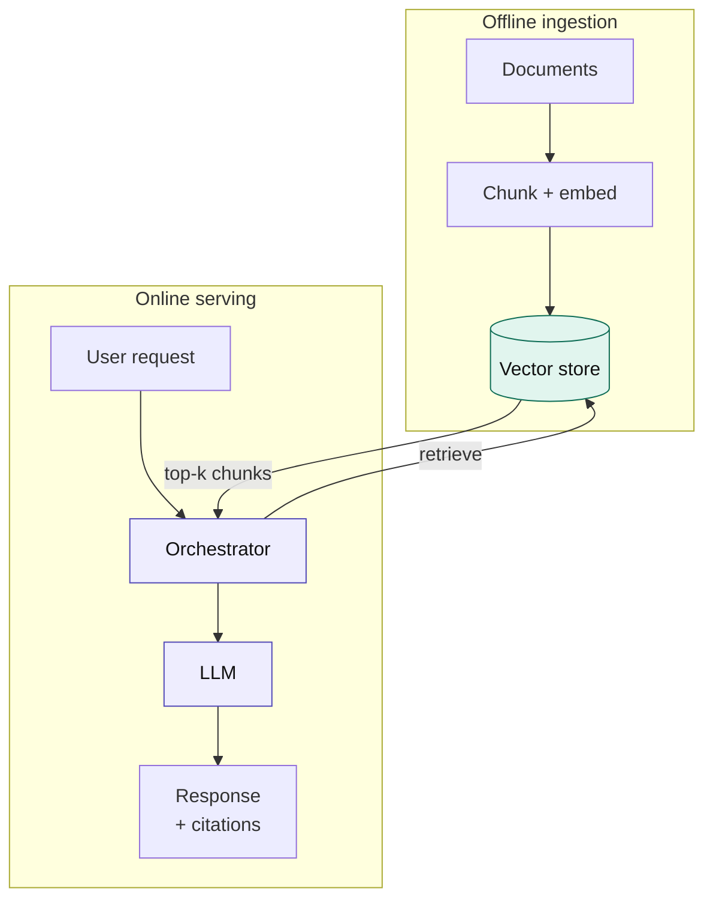
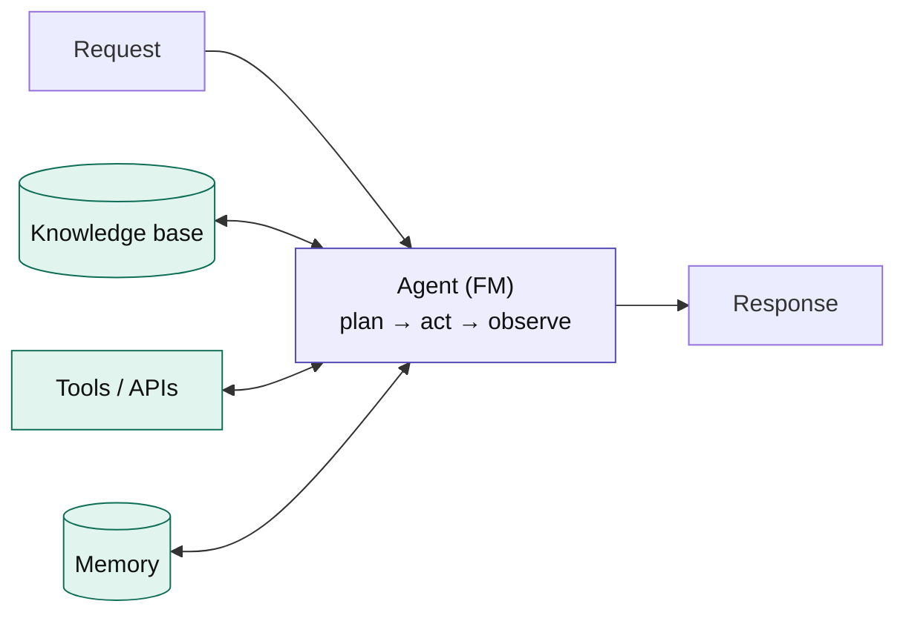
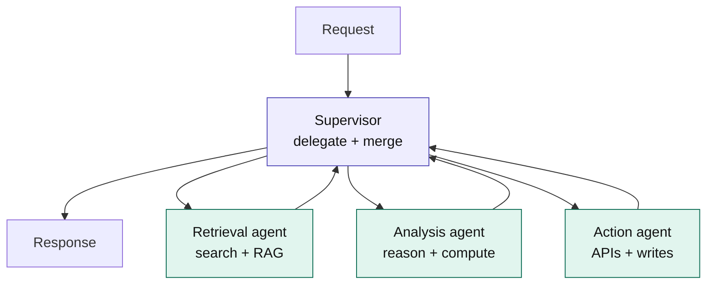
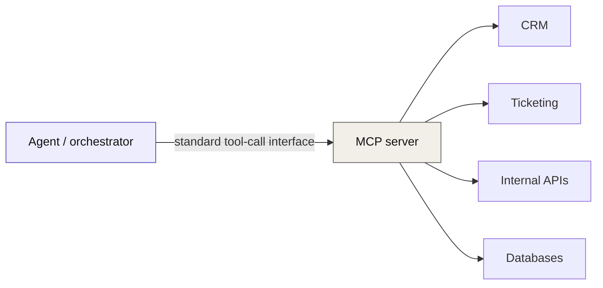

[← Back to index](../README.md) · **Section III of VII**

# III. Core Architecture Patterns

*The patterns themselves. Each one follows from a branch in Section II's decision tree — know which branch led you here before you pick a diagram.*

Every pattern below uses the same three-part breakdown: **when to propose it**, **what to get right**, **when not to use it**. That structure is the point — memorize the trade-offs, not just the boxes.

---

## 3.1 Enterprise RAG

The default starting pattern for most enterprise GenAI work. Two flows share one vector store: an **offline ingestion pipeline** and an **online serving path**.

| | |
|---|---|
| ✅ **When to propose** | Grounded Q&A over proprietary or fast-changing data; anywhere answers need citable sources for trust or compliance |
| 🎯 **Get right** | Chunking strategy and embedding model quality drive everything downstream. Add *continuous* retrieval-quality evaluation — RAG degrades silently as the corpus grows and drifts |
| 🚫 **Don't use when** | The task requires *taking an action*, not just answering — that's an agent. Or when behavior/format must change, not just knowledge — that's fine-tuning |

---

## 3.2 Tool-using agent

The unit of task automation. A foundation model runs a **plan → act → observe** loop, calling tools and a knowledge base until it produces a final response.

| | |
|---|---|
| ✅ **When to propose** | Multi-step automation where the path isn't fixed in advance — the model must plan, call tools, observe results, and adapt (case triage, dynamic troubleshooting) |
| 🎯 **Get right** | Tool design and step limits, plus **identity propagation** — every tool call must enforce what the *end user* is authorized to do, never the agent's own blanket access |
| 🚫 **Don't use when** | The steps are knowable in advance. A deterministic workflow is cheaper, faster, and far easier to audit — reach for an agent only when adaptive planning is genuinely required |

---

## 3.3 Multi-agent supervisor

For workflows too broad for one agent's context window or skill set. A supervisor decomposes the request, delegates to specialist agents, and consolidates their outputs.

| | |
|---|---|
| ✅ **When to propose** | One agent's context or skill set genuinely can't span the domains involved — e.g., retrieval + analysis + action across CRM, ticketing, and HR systems at once |
| 🎯 **Get right** | Clear boundaries between agents, *shared* observability across the whole supervisor tree, and governance applied uniformly — not per-agent |
| 🚫 **Don't use when** | This is, by far, the most over-proposed pattern in the field. Default to "one well-tooled agent" first; only escalate here when that genuinely runs out of room. Every extra agent hop adds latency, cost, and a new place to fail |

---

## 3.4 MCP and tool-use as connective tissue

The **Model Context Protocol (MCP)** and similar tool-calling standards are what let any of the patterns above call external systems through a consistent interface, instead of every team writing bespoke integration code per tool per model.

| | |
|---|---|
| ✅ **When to propose** | Any time more than one agent or pattern needs to reach the same set of enterprise systems — standardizing the interface once pays off immediately |
| 🎯 **Get right** | Treat MCP servers like any other production service: versioned, access-controlled per-caller, and monitored — not a side door that bypasses normal governance |
| 🚫 **Don't use when** | A single agent calls a single, stable internal API — a direct integration may be simpler than standing up a protocol layer for one consumer |

---

**Previous:** [← II. The Decision Layer](02-decision-layer.md) · **Next:** [IV. Platform Capabilities →](04-platform-capabilities.md)
