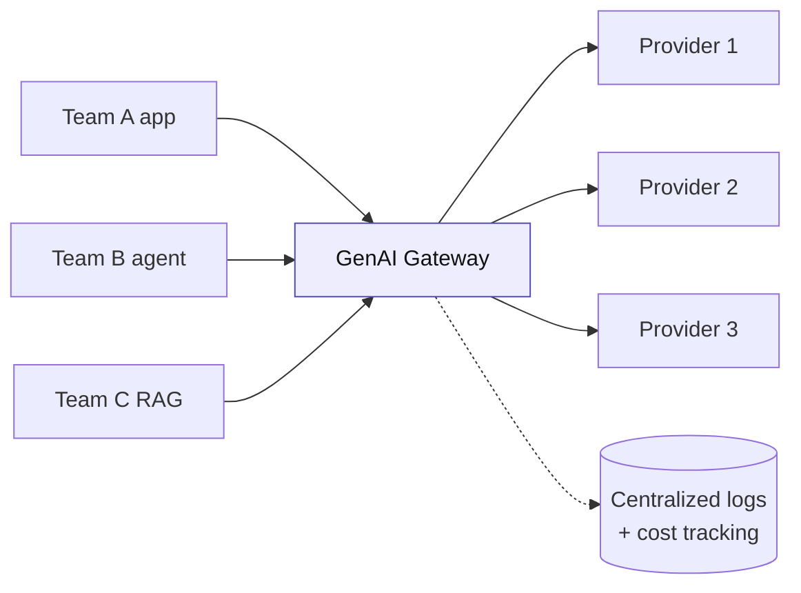
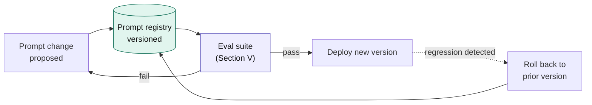
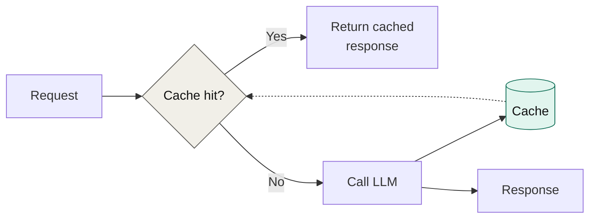

[← Back to index](../README.md) · **Section IV of VII**

# IV. Platform Capabilities

*The reusable infrastructure that makes every pattern in Section III safe to run at scale. This is what "design of reusable platform capabilities" means in practice — build these once, let every team's agent or RAG system sit on top of them.*

---

## 4.1 The GenAI gateway

A central proxy in front of every model provider. Without it, every team manages its own API keys, its own rate limiting, its own logging — and governance has no single point of control.

**What it standardizes:**

- **Auth & authorization** — one place to enforce who can call which model
- **Rate limits & quotas** — per-team budget control, preventing one runaway agent from consuming the whole org's spend
- **Model routing** — swap providers or tiers without every consuming team changing code
- **Streaming** — consistent response-streaming behavior across all consumers
- **Centralized logging** — the foundation that Section V's observability layer depends on

| | |
|---|---|
| ✅ **When to propose** | More than one team or application will call LLMs — i.e., almost always at enterprise scale |
| 🎯 **Get right** | Make the gateway the *only* path to model access. A gateway that's optional gets bypassed under deadline pressure, and you lose the governance point entirely |
| 🚫 **Don't use when** | A single small team, single application, pre-production prototype — the overhead isn't justified yet. Revisit the moment a second team wants in |

## 4.2 Prompt registry & versioning

Prompts are production code. Treat them like it.

**What it standardizes:** every prompt change is versioned, tested against an eval suite before deployment, and revertible the same way you'd revert any other code change. Without this, "we tweaked the prompt" becomes an untracked, unauditable production change — exactly the failure mode that makes agentic systems hard to trust.

| | |
|---|---|
| ✅ **When to propose** | Any prompt that's iterated on by more than one person, or that touches a regulated or customer-facing workflow |
| 🎯 **Get right** | Wire it to the eval suite (Section V) so a prompt change can't ship without a regression check |
| 🚫 **Don't use when** | A one-off internal prototype with a single owner and no production stakes |

## 4.3 Vector store selection

A recurring decision, not a one-time pick — different RAG systems in the same org may legitimately land on different stores.

| Factor | Favors managed cloud (Azure AI Search, OpenSearch Serverless) | Favors self-hosted / open-source (Qdrant, pgvector, Chroma) |
|---|---|---|
| **Data residency** | Acceptable to keep vectors in the cloud provider | Must stay in your own infrastructure (compliance, air-gapped) |
| **Ops burden** | Want it fully managed | Have the team to operate it, want cost control |
| **Existing stack** | Already committed to that cloud | Already running Postgres / Kubernetes elsewhere |
| **Scale** | Need turnkey scale-out | Scale is moderate, predictable |

**The deeper architectural point:** the vector store choice should follow from the same compliance and hosting drivers as the model choice in Section VII — keep these decisions consistent across one project rather than picking each component in isolation.

## 4.4 Caching

The most under-discussed cost and latency lever in production LLM systems.

Two layers worth distinguishing:

- **Prompt caching** — exact or near-exact repeated prompts (e.g., a stable system prompt reused across many calls) skip reprocessing of the unchanged portion. Many model providers support this natively and it's close to a free win.
- **Semantic caching** — recognizes that two *differently worded* questions have the same answer, and serves the cached response. Higher payoff for high-volume, repetitive query patterns (FAQ-style support); higher risk of serving a stale or subtly wrong answer if similarity thresholds are too loose.

| | |
|---|---|
| ✅ **When to propose** | High call volume, repeated or templated queries, latency-sensitive UX |
| 🎯 **Get right** | Set semantic-similarity thresholds conservatively at first — an overly aggressive cache returns confidently wrong answers to questions that only *look* similar |
| 🚫 **Don't use when** | Highly unique, one-off queries per call — there's nothing to cache against |

---

**Previous:** [← III. Core Architecture Patterns](03-core-patterns.md) · **Next:** [V. Production Operations →](05-production-operations.md)
