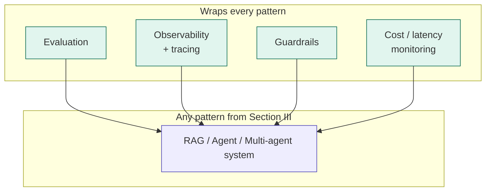
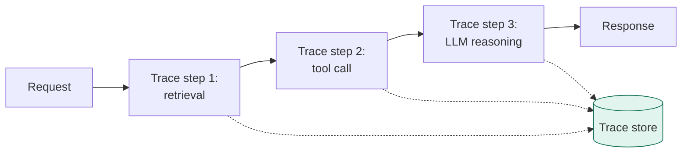
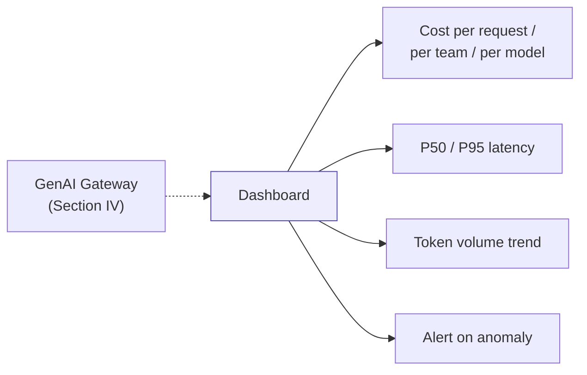

[← Back to index](../README.md) · **Section V of VII**

# V. Production Operations

*The lane every diagram-only tutorial skips — and the part that actually separates a production architecture from a demo. If you take one section of this primer into a design review, make it this one.*

---

## 5.1 Why this section exists

Go back to any diagram in Section III. Every one of them answers "what does the system do." None of them answer **"how do you know it's working, and how do you find out when it stops?"** That second question is what enterprises actually get burned on after launch — not the architecture diagram, the operational layer around it.

## 5.2 Evaluation

Two distinct evaluation needs, often confused:

| Type | Question it answers | Method |
|---|---|---|
| **Offline / regression eval** | "Did this prompt or model change make things worse?" | A fixed, versioned test set run before every deploy; LLM-as-judge scoring or rule-based checks against known-good answers |
| **Online / production eval** | "Is quality holding up on real traffic right now?" | Sampling live outputs for human or automated review; user feedback signals (thumbs up/down); drift detection over time |

**Get right:** build the offline eval set *before* you need it, not after the first production incident. A test set assembled in panic, after something has already gone wrong, tends to only cover the failure you just saw — not the next one.

**Don't skip this for:** agents and multi-agent systems especially. A RAG system that gives a slightly wrong answer is bad; an agent that takes a slightly wrong *action* can be much more costly, and you won't catch that gap without deliberate eval.

## 5.3 Observability and tracing

For any system more complex than a single LLM call, you need to see the **full trace** — not just final input/output, but every intermediate step.

**Why this matters more for agents than for simple RAG:** when an agent makes a wrong decision, the question is never just "what did it answer" — it's "what did it retrieve, what tool did it call, with what arguments, and at what point did the reasoning go sideways." Without step-level tracing, debugging an agent in production is close to impossible.

**Get right:** capture the full context window, every tool call and its arguments, every intermediate model response, and any human override — *before* you need it for an incident. Retrofitting tracing after a production issue means the issue that already happened is the one case you have no trace for.

## 5.4 Guardrails

Layered checks that run **around** the model call, not instead of good architecture.

| Layer | Catches |
|---|---|
| **Input guardrails** | Prompt injection attempts, PII in the incoming request, out-of-scope queries |
| **Output guardrails** | PII leakage, toxic or off-brand content, hallucinated claims that contradict retrieved sources |
| **Action guardrails** (agents only) | Destructive or high-stakes actions that need a confirmation step or human-in-the-loop before executing |

**Get right:** action guardrails are the one category unique to agents, and the one most often forgotten by teams whose prior experience is all RAG/chatbot. The moment a system can *do* something — send an email, modify a record, issue a refund — the cost of a wrong output stops being "an embarrassing chat message" and starts being a real-world side effect. Bound what an agent can do autonomously vs. what requires a human confirmation, explicitly, as part of the architecture — not as an afterthought.

## 5.5 Cost and latency monitoring

The dashboard layer that turns "this seems expensive" into an actual operational signal.

**Get right:** track cost and latency **per team and per use case**, not just in aggregate. An org-wide average hides the one runaway agent burning 80% of the budget. This also closes the loop back to Section 1.3's capability-tier routing — without per-use-case cost visibility, nobody notices that a high-volume simple task has been quietly sending every call to the most expensive model tier.

---

## 5.6 The production-readiness checklist

A fast self-check before calling any architecture "production-ready":

- [ ] Offline eval set exists and runs before every prompt/model change
- [ ] Online quality sampling or feedback signal is wired up
- [ ] Full request tracing is in place (not just final input/output)
- [ ] Input, output, and (if agentic) action guardrails are explicit, not implied
- [ ] Cost and latency are visible per use case, not just in aggregate
- [ ] There's a defined rollback path for a bad prompt or model version
- [ ] High-stakes agent actions have a human-confirmation or hard-bounded scope

If you can't check every box, the diagram is a prototype, not a production architecture — regardless of how polished the pattern in Section III looks.

---

**Previous:** [← IV. Platform Capabilities](04-platform-capabilities.md) · **Next:** [VI. Industry Walkthroughs →](06-industry-walkthroughs.md)
