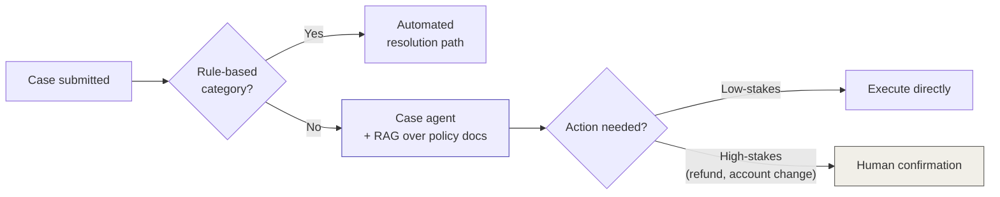
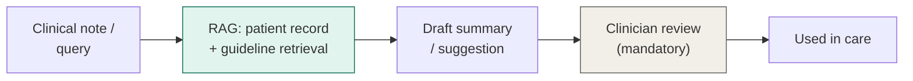
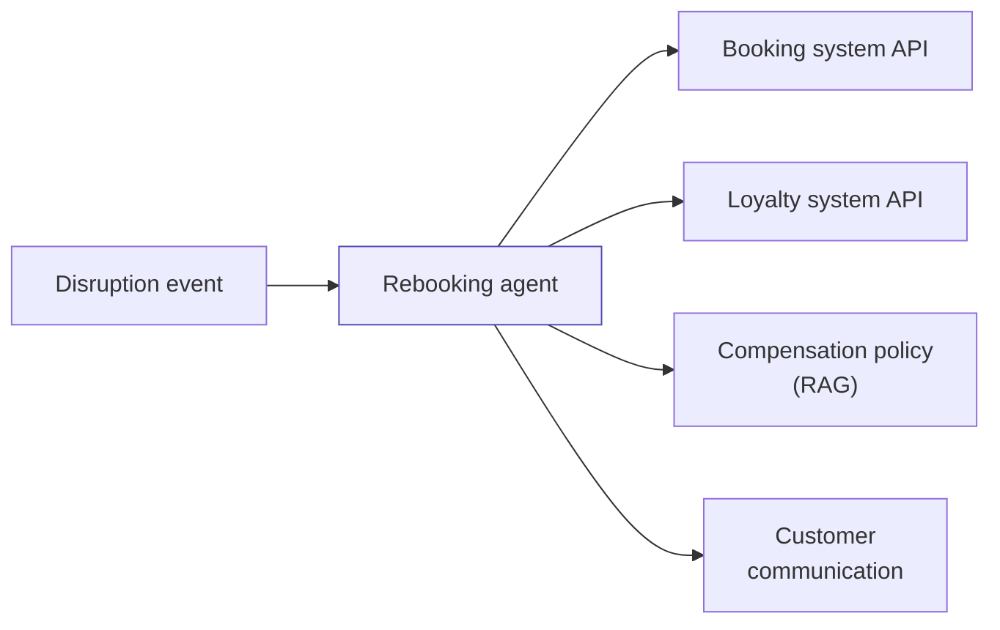

[← Back to index](../README.md) · **Section VI of VII**

# VI. Industry Walkthroughs

*The same decision layer (Section II) and patterns (Section III) applied to four real domains. Each walkthrough shows the reasoning, not just the answer — that reasoning is what you'd actually say out loud in a design review.*

---

## 6.1 Banking: customer case / dispute resolution

**Use case:** automate triage and resolution of customer service cases (disputes, account inquiries, change requests).

**Walking the decision layer:**
- *Gate:* Case categorization is partly rule-based (clear categories) and partly language-dependent (free-text complaint descriptions) → GenAI needed for the language-understanding portion, but route obviously rule-based cases out via classifier first.
- *RAG vs. fine-tune vs. workflow vs. agent:* Needs RAG (grounded in current policy documents, account data) and most likely an **agent**, since case resolution requires multi-step action — look up account history, check policy, draft a response, potentially trigger a refund or escalation — and the right sequence depends on what's found at each step.

**Pattern:** Tool-using agent (3.2) with RAG grounding, wrapped in strict guardrails — this is a regulated, financial-impact domain.

**What makes this hard in practice:** the action guardrails from Section 5.4 aren't optional here — a wrong autonomous refund is a real financial and compliance event, not a bad chat message. Identity propagation (3.2) also matters acutely: the agent must only access and act on the requesting customer's own account.

---

## 6.2 Healthcare: clinical documentation and decision support

**Use case:** summarizing clinical notes, supporting (not replacing) clinical decisions, surfacing relevant guidelines.

**Walking the decision layer:**
- *Gate:* Definitely needs language understanding — clinical notes are unstructured free text.
- *RAG vs. fine-tune vs. workflow vs. agent:* RAG is close to mandatory here — answers must be grounded in current clinical guidelines and the specific patient's record, with citations, for both safety and compliance. A **workflow** (not a free-running agent) is usually the right control-flow choice: the steps — retrieve patient history, retrieve relevant guideline, draft summary, flag for clinician review — are knowable in advance, and a fixed, auditable path is preferable to an autonomous loop in a domain where wrong decisions have outsized stakes.

**Pattern:** RAG (3.1) inside a deterministic workflow, with a mandatory human-in-the-loop step before anything reaches clinical use.

**What makes this hard in practice:** this is the clearest domain where "agent" is the wrong, over-eager answer. The simple pattern (RAG + fixed workflow + mandatory human review) is correct *because* the stakes are high, not despite them — auditability and a fixed, explainable path matter more than autonomy.

---

## 6.3 Travel / airline: itinerary disruption handling

**Use case:** rebooking and customer communication when a flight is delayed or cancelled.

**Walking the decision layer:**
- *Gate:* Definitely needs GenAI for natural customer communication; the rebooking logic itself may be partly rules/constraint-solving (seat availability, fare rules) — don't make the LLM do arithmetic or constraint-checking it's bad at; call existing booking-system APIs as tools instead.
- *RAG vs. fine-tune vs. workflow vs. agent:* This is a strong **agent** candidate — the right sequence of actions (check rebooking options, check loyalty status, check policy on compensation, draft the communication) genuinely depends on what's discovered at each step, and varies a lot by situation.

**Pattern:** Tool-using agent (3.2), where the tools are existing booking, loyalty, and policy systems — the agent's job is orchestration and communication, not reimplementing booking logic.

**What makes this hard in practice:** the temptation is to let the LLM "figure out" rebooking logic in free text. Don't — push every deterministic calculation (fares, availability, eligibility) into tool calls the agent invokes, and keep the model's job to orchestration and natural-language communication, where it actually adds value.

---

## 6.4 Cross-industry pattern: customer service / case automation

This use case appears in every industry above, so it's worth naming the **shared shape** directly: it is almost always RAG + agent, almost never fine-tuning, and the differentiator between industries is the *strictness of the guardrails*, not the core pattern.

| Industry | Core pattern | What changes |
|---|---|---|
| Banking | RAG + agent | Strict action guardrails, identity propagation, regulatory audit trail |
| Healthcare | RAG + workflow | Mandatory human-in-the-loop, no autonomous action |
| Travel | RAG + agent | Heavier tool integration with existing booking systems |
| General customer service | RAG + agent | Lightest guardrails of the four, but still needs eval + escalation path |

**The takeaway to bring into any internal debate:** when colleagues across different business units argue about "the right architecture" as if each industry needs something bespoke, the honest answer is usually that **the core pattern barely changes — the operations layer (Section V) and guardrail strictness do.** That reframing alone resolves a surprising number of cross-team architecture debates.

---

**Previous:** [← V. Production Operations](05-production-operations.md) · **Next:** [VII. Cloud-Specific Mappings →](07-cloud-mappings.md)
